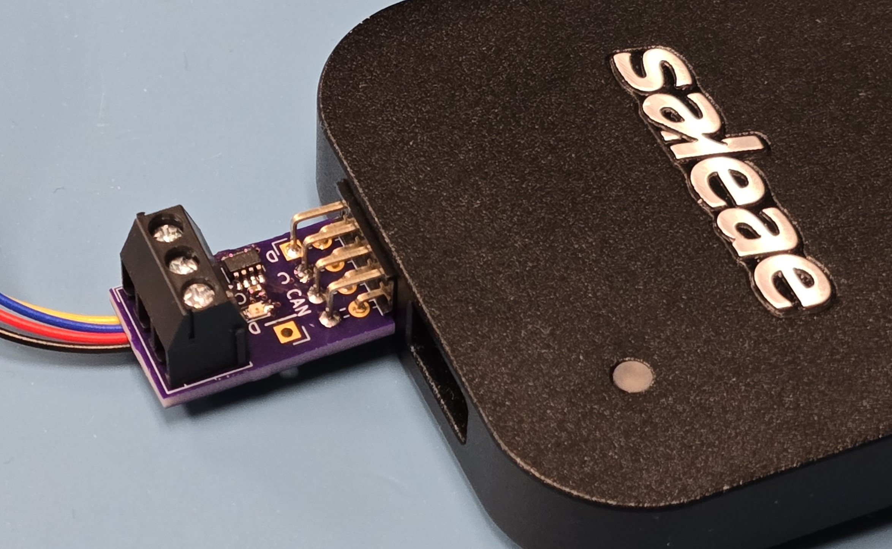

# Qwiic and CAN to Saleae Adapter

## Background

This board is meant to provide a quick (pardon the pun) adapter between I2C and CAN to the Saleae.  Specifically, it provides just enough interface to adapt the signals to something the Saleae can easily handle.

For the I2C side, it provides a standard [QWIIC](https://www.sparkfun.com/qwiic) connection which includes pull up resistors.

For the CAN side, it provides a [transceiver chip](https://www.analog.com/en/products/MAX33040E.html) which will take the differential signal and convert it to single sided. The extra features of the chip aren't used, so they've been disabled.  The power for the chip is provided by the QWIIC connection.  There is a 120 Ohm resistor with a solder jumper to cut in case you want to disable that.

## Version History

1. v1.0 First build.  
    1. QWIIC connector is blocked by the screw terminal pins.  A workaround is to clip the pins before soldering. Real solution would be to turn the QWIIC connector 90 Degrees or to move it to the top layer
    1. Saleae connector is mostly fine, but could be moved out by ~1mm so that the connector mates completely with the saleae.
    1. CAN Labels are obscured by the plugged in Qwiic connector. Rotating the connector will help, but labelling better would be preferred.
1. v2
    1. Moved all components to top layer (in prep for possibly ordering assembly from JLC)
    1. Add a second QWIIC connector
    1. Move CAN connector to end and make it psuedo-edge launch
